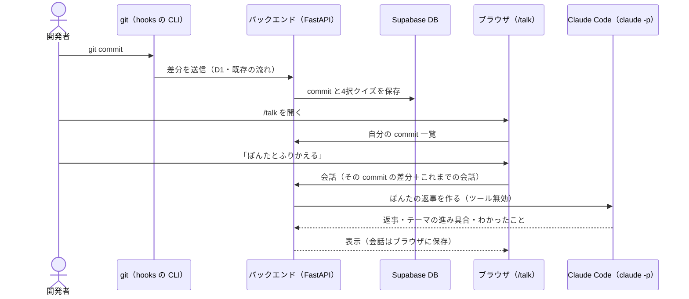

# ぽんたと commit をふりかえる画面（/talk）ガイド

自分の commit を選んで、タヌキのキャラクター「ぽんた」と会話しながらふりかえる画面の説明と、
commit してから会話するまでの全体の使い方です。

> **テスト環境（ローカル）専用の機能です。** ぽんたの返事は、バックエンドを動かしている人の
> Claude Code（`claude -p`）が作ります。既存の画面（`/quizzes/{id}`・`/connect`）と API（D1〜D5）には影響しません。

---

## 1. これは何か

| | 4択クイズ（既存 `/quizzes/{id}`） | ぽんたとふりかえる（`/talk`） |
|---|---|---|
| やること | 差分から作られた4択に答える | ぽんたの問いかけに、自分の言葉で答える |
| 問題 | commit 時に3問を作って保存 | 会話の流れに合わせて、その場で Claude が問いかけを作る |
| ゴール | 全問正解で push 許可 | 3つのテーマを自分の言葉で話せる（理解度 3/3） |
| push との関係 | pre-push フックが合否を確認する | **関係しない**（push の判定には使わない） |

ぽんたと話す3つのテーマ（どの commit でも共通）:

1. **変更の意図** … なぜこの変更をしたのか、何を良くしたいのか
2. **影響範囲** … どこに影響が出るか、どんなときに困りそうか、他の処理とのつながり
3. **改善ポイント** … もっと良くするには、何を確認・テストすべきか

ぽんたは「正解を当てさせる」のではなく、説明が浅ければ掘り下げる質問をし、こちらの質問にも答えてくれます。
同じテーマで2回聞いても出てこないときや「わからない」と言ったときは、ヒントや答えをやさしく教えて先へ進みます。

---

## 2. 全体の流れ



- commit を送る部分（CLI・D1）は既存の仕組みのままです。`/talk` 用に何かを追加でセットアップする必要はありません。
- `/talk` は DB を**読むだけ**です。会話はサーバーに保存しません。

---

## 3. はじめての準備

### 3.1 必要なもの

- `git pull` 済みのこのリポジトリ
- [uv](https://docs.astral.sh/uv/)（バックエンド）、Node.js（フロント）、Go（CLI をビルドする場合）
- **Claude Code（`claude` コマンド）にログイン済みであること**
  - ターミナルで `claude` を一度起動してログインしておく
  - ぽんたの返事 1 回ごとに、**各自の Claude Code の利用枠**を使います
- `backend/.env` と `frontend/.env.local`（作り方は `backend/.env.example`・`frontend/.env.example`。値はチームで共有している Supabase のもの）

### 3.2 依存を入れて起動する

```
cd backend && uv sync
```
```
cd backend && uv run uvicorn app.main:app --port 8100
```
```
cd frontend && npm install && npm run dev
```

- フロントは Vite の既定で `http://localhost:5173` で開きます（5173 が使用中なら 5174 などになります。ターミナルの表示を見てください）。
- フロントのポートが 5173 以外になったときは、`backend/.env` の `CORS_ORIGINS` にそのポートが入っているか確認してください。

### 3.3 GitHub でログインする

1. ブラウザで `http://localhost:5173/connect` を開き、GitHub でログインする
2. 表示された **user_id** を控える（CLI の設定に使います）

### 3.4 commit をバックエンドに送れるようにする（リポジトリごとに 1 回）

`/talk` に出てくるのは、**バックエンドに送られた自分の commit** だけです。学習したいリポジトリで CLI の初期設定をします
（CLI の入れ方は [hooks/README.md](../hooks/README.md)）。

```
nanicommit init --backend-url http://localhost:8100 --user-id <あなたの user_id>
```

init がリポジトリをバックエンドに自動で登録し、発行された repository_id を保存します（CLI をこの変更以降のコードでビルドし直してください）。
2 回目以降の init で再登録はされません。

設定が済むと、**commit するたびにこの `/talk/<commit_id>` ページがブラウザで自動的に開きます**（開きたくないときは `NANICOMMIT_NO_BROWSER=1`）。

**古い CLI を使う場合**（自動登録が無いので、先にリポジトリ ID を発行してから init する）

```
curl -s -X POST http://localhost:8100/api/v1/repositories -H "X-User-Id: <あなたの user_id>" -H "Content-Type: application/json" -d "{\"name\": \"$(basename "$PWD")\", \"learning_base_sha\": \"$(git rev-parse HEAD)\"}"
```
```
nanicommit init --repository-id <返ってきた repository_id> --backend-url http://localhost:8100 --user-id <あなたの user_id>
```

（commit が 1 つも無いリポジトリでは `learning_base_sha` を `null` にします。）

---

## 4. 使い方

### 4.1 commit してから会話するまで

1. いつも通り `git commit` する（4択クイズもいつも通り作られます）
2. `http://localhost:5173/talk` を開く → 自分の commit が新しい順に並ぶ（最大 30 件）
3. ふりかえりたい commit の「**ぽんたとふりかえる**」を押す
   - CLI が表示するクイズの URL（`…/quizzes/<id>`）の `quizzes` を `talk` に変えても、同じ commit の会話画面が開きます
4. ぽんたが差分を読んで、あいさつと最初の問いかけをしてくれる（数秒かかります）
5. 入力欄に自分の言葉で答える
   - **Enter で送信、Shift+Enter で改行**（日本語の変換中の Enter では送りません）
   - わからないことは、ぽんたに質問してかまいません
6. 3つのテーマを話せると、右側に「今日のふりかえり」が出ます

### 4.2 画面の見かた

| 場所 | 内容 |
|---|---|
| 左 | コミット（SHA・メッセージ・リポジトリ・ブランチ・ファイルと増減）、話したいポイント（3テーマの進み具合）、一覧へ戻るリンク |
| 中央 | 差分（左が変更前・右が変更後。複数ファイルはタブで切替、「たたむ」で閉じる）、ぽんたとの会話、入力欄 |
| 右 | 理解度 n/3、会話でわかったこと（自分で説明できたことが最大 5 つたまる）、今日のふりかえり（3つ話せたら） |

ぽんたの絵は状態で変わります: 差分を読んでいる（ノートPC）／考え中（あごに手）／質問・説明（本）／褒める（バンザイ）。

### 4.3 続きから話す・やり直す

- 会話・理解度・わかったことは**ブラウザ（localStorage）に保存**されます。同じブラウザで開き直すと続きから話せます。
  一覧にも「ふりかえり n/3」と出ます。
- 別のブラウザや PC には引き継がれません。
- 「**最初からやり直す**」→「消してやり直す」で、その commit の会話を消してあいさつからやり直せます。

---

## 5. うまくいかないとき

| 表示・症状 | 原因と対処 |
|---|---|
| 「Claude Code（claude コマンド）が見つかりません…」 | バックエンドを動かしている PC に `claude` が無い、または PATH に無い。Claude Code を入れてログインし、バックエンドを起動し直す |
| 「ぽんたの返事を作れませんでした」 | Claude の呼び出しに失敗した（ログイン切れ・利用枠の上限・タイムアウト 120 秒など）。少し待って再送する。詳しい理由はバックエンドのログに出ます |
| 「ぽんたはまだ前の返事を考えています」 | 同じ人が同時に送れるのは 1 つまで。返事が来てから送る（別タブで同時に話している場合も） |
| 「ログインが必要だよ」「ログインが切れたみたい」 | `/connect` で GitHub ログインしてから `/talk` を開き直す |
| 一覧に commit が出ない | ① そのリポジトリで init していない ② commit したときバックエンドが止まっていた ③ CLI の user_id と、ブラウザでログインしている人が違う。`nanicommit status` で設定を確認する |
| 「この commit は見つからないよ」 | URL の ID が違うか、他の人の commit。自分の commit しか開けません |
| 画面が出ない・API に繋がらない | バックエンド（8100）が動いているか、`frontend/.env.local` の `VITE_API_BASE_URL`、`backend/.env` の `CORS_ORIGINS` を確認する |

---

## 6. 仕組みと制約（開発者向け）

### API（すべて Web 用の認証 `Authorization: Bearer <Supabase のトークン>`）

| メソッド | パス | 内容 |
|---|---|---|
| GET | `/api/v1/talk/commits` | 自分の commit 一覧（新しい順・最大 30 件、クイズの状態つき） |
| GET | `/api/v1/talk/commits/{id}` | 1 件の詳細（メッセージ・ブランチ・ファイル・差分）。他人のものは 404 |
| POST | `/api/v1/talk/commits/{id}/chat` | ぽんたの次の返事。`messages` が空なら最初のあいさつ |

### 制約

- 1 発言 1,500 字、会話は直近 24 発言までを Claude に渡します。差分は先頭 30,000 字まで（超えた分は省略したと伝えます）。
- 同じ人の同時実行は 1 つまで（バックエンドのメモリで管理。uvicorn 1 プロセス前提）。
- `claude -p` は**ツールをすべて無効**（`--tools ""`）にし、ユーザー設定・MCP を読まず、空の一時フォルダで動かします。
  差分やメッセージ・発言の中の「指示」には従わないようプロンプトでも指定しています。

### 既存の画面・API への影響

ありません。

- バックエンド: `app/routers/talk.py`・`app/talk/` を追加し、`app/main.py` にルーターを登録しただけ。DB は読むだけで、スキーマ変更なし。
- フロント: `src/talk/` 以下だけ。`main.tsx` で `/talk` のときだけ別チャンクとして読み込むので、既存画面に talk の JS・CSS・フォントは入りません。

### ファイル構成

| 場所 | 内容 |
|---|---|
| `backend/app/routers/talk.py` | API 3 つ |
| `backend/app/talk/prompt.py` | ぽんたの設定と、Claude に渡すプロンプト |
| `backend/app/talk/chat.py` | 入力の切り詰め・返事の後処理（テーマの done は戻さない等） |
| `backend/app/learning/claude_cli.py` | `claude -p` を安全に呼ぶ共通処理 |
| `backend/tests/test_talk.py` | テスト |
| `frontend/src/talk/` | 画面（一覧・会話）、差分の左右表示、保存、専用 CSS とテスト |
| `frontend/public/talk/` | ぽんたの絵（5 種類） |

### 関連: 4択クイズの問題作成を Claude にする（任意）

`backend/.env` に `QUIZ_LLM=claude` を書くと、4択クイズの問題作成も Gemini ではなく Claude Code で行います
（書かなければ今まで通り Gemini）。`/talk` の会話はこの設定に関係なく、常に Claude Code を使います。
