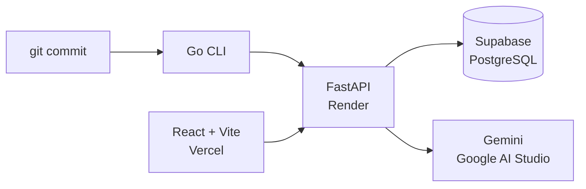

# 技術スタック

このファイルは、リポジトリの実体（`package.json`・`pyproject.toml`・`go.mod`・ソースコード・マイグレーション）に基づく技術スタックの一覧です。

## 概要

| 領域 | ディレクトリ | 採用技術 | デプロイ先 |
|---|---|---|---|
| CLI / Git フック | `hooks/` | Go 1.22（標準ライブラリのみ） | 利用者のPC |
| フロントエンド | `frontend/` | React 19 + Vite 7 + TypeScript 5.8 + Tailwind CSS 4 | Vercel |
| バックエンド | `backend/` | FastAPI + uvicorn（Python 3.12、uv） | Render（Python ランタイム、Docker なし） |
| DB | `supabase/` | Supabase PostgreSQL | Supabase |
| 認証 | `backend/app/auth.py` | Supabase Auth（GitHub OAuth） | Supabase |
| 問題生成（LLM） | `backend/app/learning/` | Google AI Studio の Gemini（MCP Server 経由） | — |

## データの流れ

1. 開発者が `git commit` する
2. post-commit フックが Go CLI（`commitcoach`）を起動する
3. CLI が commit を6項目の JSON にする（スキーマ：`docs/commit-payload.schema.json`）
4. CLI が JSON をバックエンドの `POST /api/v1/commits` へ送る
5. バックエンドが問題を3問生成し、Supabase PostgreSQL に保存する
6. 問題生成は MCP Client → MCP Server → Gemini の順に呼ぶ
7. 開発者がブラウザ（フロントエンド）で問題に回答する
8. pre-push フックが CLI 経由で `POST /api/v1/push/check` を呼び、全問正解なら push を続行する

## CLI / Git フック

- ディレクトリ：`hooks/`
- 言語：Go 1.22（`hooks/go.mod`）
- 外部依存：なし（`go.sum` なし）
- バイナリ名：`commitcoach`（`hooks/cmd/commitcoach/main.go`）
- コマンド：`init`・`hook post-commit`・`export`・`status`・`uninstall`
- Git 操作：`git` コマンドをサブプロセスで実行する（`hooks/internal/gitrepo/`）
- 出力形式：6項目の JSON（`repository_id`・`commit_sha`・`branch`・`message`・`files`・`diff`）
- ローカル保存先：`.git/commitcoach/events/`
- テスト：`go test ./...`

## フロントエンド

- ディレクトリ：`frontend/`
- デプロイ先：Vercel
- アプリ形式：SPA（`docs/design.md` には Next.js とあるが、実際は React + Vite）
- ビルドコマンド：`npm run build`（`tsc --noEmit && vite build`）
- ビルド出力：`dist/`（静的ファイル）

| 用途 | パッケージ | バージョン |
|---|---|---|
| UI | `react` / `react-dom` | ^19.1.0 |
| ビルド・開発サーバー | `vite` | ^7.1.0 |
| React プラグイン | `@vitejs/plugin-react` | ^5.0.0 |
| 言語 | `typescript`（strict） | ~5.8.3 |
| スタイル | `tailwindcss` / `@tailwindcss/vite` | ^4.1.0 |
| テスト | `vitest` | ^3.2.0 |

- 状態管理：`useReducer`（`frontend/src/state/quizReducer.ts`）。状態管理ライブラリなし
- ルーティング：ライブラリなし
- 差分表示：自前実装（`frontend/src/lib/diff.ts`）
- データ取得：`frontend/src/data/api.ts` に集約

## バックエンド

- ディレクトリ：`backend/`
- デプロイ先：Render（Web Service、Python ランタイム、Docker なし。手順は `backend/README.md`）
- Python：3.12（`backend/.python-version`）
- パッケージ管理：uv（`backend/uv.lock`）
- 起動コマンド：`uv run uvicorn app.main:app --reload`
- テスト：`uv run pytest`

| 用途 | パッケージ | バージョン |
|---|---|---|
| Web フレームワーク | `fastapi` | >=0.115 |
| ASGI サーバー | `uvicorn[standard]` | >=0.30 |
| DB ドライバ | `psycopg[binary,pool]`（psycopg 3、非同期） | >=3.2 |
| 設定読み込み | `pydantic-settings` | >=2.4 |
| Supabase Auth | `supabase`（`supabase_auth.AsyncGoTrueClient` を使用） | >=2.7 |
| テスト（dev） | `pytest` / `httpx` / `pgserver` | >=8 / >=0.27 / >=0.1.4 |

- DB アクセス：ORM なし。psycopg で SQL を直接書く（`backend/app/db.py`）
  - `AsyncConnectionPool` を使う
  - 行は dict で返る（`dict_row`）
  - Supabase の transaction pooler 対応のため prepared statement を無効化
- 認証（`backend/app/auth.py`）
  - CLI 向け API：ヘッダ `X-User-Id` の UUID が `auth.users` に存在するか確認する
  - Web 向け API：`Authorization: Bearer <Supabase access token>` を Supabase Auth サーバーで検証する
- 問題生成（`backend/app/learning/runner.py`）：環境変数 `QUIZ_GENERATOR` で切り替える
  - `fake`：commit の内容から機械的に3問を作る（開発用）
  - `mcp`：`app.learning.generate.generate_quiz` を呼ぶ
  - タイムアウト：30秒（`GENERATION_TIMEOUT_SECONDS`）
- API：
  - `POST /api/v1/repositories`：リポジトリ登録
  - `POST /api/v1/commits`：commit 受信・問題生成・保存
  - `POST /api/v1/push/check`：push 可否の確認
  - `GET /health`：疎通確認

## DB

- 種類：Supabase PostgreSQL
- マイグレーション：`supabase/migrations/20260925000000_init.sql`
- テーブル：`repositories`・`commits`・`questions`・`answers`
- RLS：全テーブルで有効。学習データはブラウザから直接操作させず、FastAPI 経由でのみアクセスする

## 認証

- 方式：Supabase Auth の GitHub OAuth（Web のみ）
- CLI の識別：Web で確認した user_id を CLI に設定し、`X-User-Id` ヘッダで送る

## 問題生成（LLM）

- モデル：Google AI Studio の Gemini
- 呼び出し方：FastAPI が MCP Client となり、問題生成 MCP Server の `generate_quiz` tool を呼ぶ。FastAPI からモデルの API は直接呼ばない（`docs/design.md`）
- 出力：4択3問（`backend/app/schemas.py` の `GeneratedQuiz`）

## テストコマンド

| 対象 | コマンド |
|---|---|
| CLI | `cd hooks && go test ./...` |
| フロントエンド | `cd frontend && npm test` |
| フロントエンド（型チェック + ビルド） | `cd frontend && npm run build` |
| バックエンド | `cd backend && uv run pytest` |
